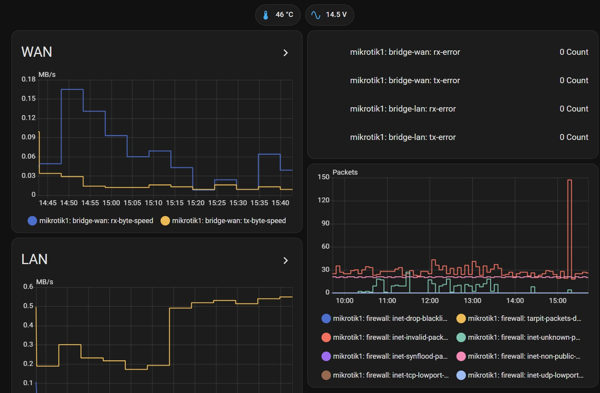

# mikrotik2mqtt
Collecting hardware state and network statistics from the MikroTik router(s)  
Requires:
- python3
- SSH module. Works with https://github.com/ParallelSSH/ssh-python 

Intended to be run as a systemd service.
_Tested under Fedora Linux 40+_

## Slightly longer intro
This script uses SSH to access the [MikroTik](https://mikrotik.com) brand router's to produce several kinds of reports:
1) Health: temperature, PSU voltage and system resources
2) Network statistics per interface specified
3) Firewall counts for the rules that have a special tag in their commentary field
4) User-defined firewall queries

All data is packed in JSON and passed to the MQTT publishing agent.  
Specifically, the [mqtt-tool](https://github.com/kadavris/mqtt) was designed to be usable in this case. Although you can use any other program that does your own bidding.  

### The .ini file
The default directory for .ini placement is `/etc/smarthome/reporters/`
and default config name is `/etc/smarthome/reporters/mikrotik.ini`

See the [.ini file sample](mikrotik2mqtt.ini.sample) for options with actual names and verbose description  

### The MQTT hierarchy tree

All topic definitions are nested under the .ini's `topic_root` key.
**WARNING! You need to configure it to be different for each of the monitored routers.**
Or there be a mess.

Information of available upgrades for hardware/packages can be put into `topic_upgrades`

Then there are topics dedicated to bear specific bits of data, that should be available without the need of JSON parsing:
* `<topic_voltage>` - device's PSU voltage
* `<topic_temperature>` - degrees of Celsius (actually may depend on the router's settings)

The topics that provide networking stats:
* `<topic_traffic>` - top of the traffic statistics hierarchy
* `<get_firewall_by_id>` - topic's name to report JSON package of tagged firewall rules
* `<get_firewall_whereXXX>` - topic's name  for user-defined queries

Additionally, there are special topics:
- `<root_topic>/updated` - lets you see if the data is fresh:  
  The package format is:    
  { "date":"Human readable date/time", "timestamp":UNIX_timestamp }`
- `<root_topic>/system/resources` - JSON form of `/system resources print`
---
# [Home assistant integration](homeassistant)

The python script is provided for automatic generation of Sensors/Entities
using it's own and of the main service .ini files. 

---
The repo is in <https://github.com/kadavris/monitoring>  
Copyright by Andrej Pakhutin (pakhutin at gmail)  
See the LICENSE file for licensing information
